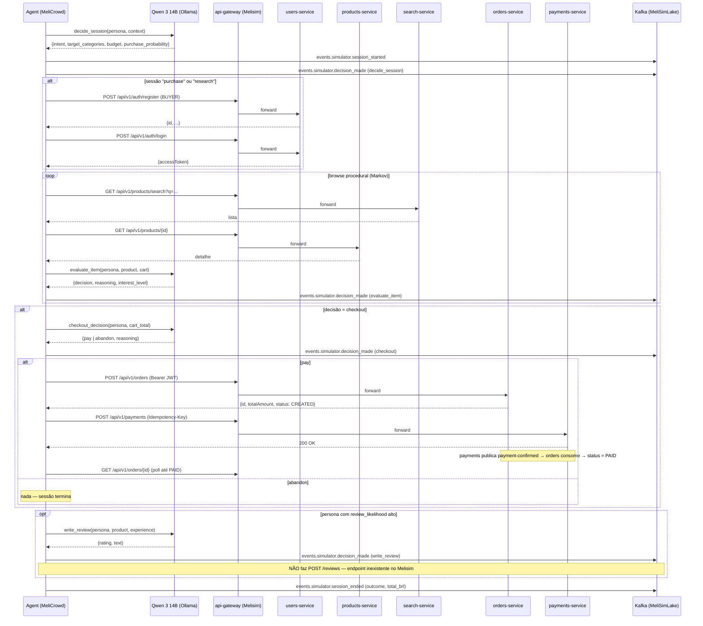

# RECON — Reconhecimento Pré-Implementação

> **Status:** Concluído. Aguardando aprovação para iniciar Fase 1.
> **Data:** 2026-05-06
> **Autor:** Claude Opus 4.7
> **Sistemas inspecionados:** `MeliSim`, `melisimlake`

Este documento mapeia o terreno antes de qualquer linha de código do MeliCrowd.
Lista endpoints, redes, portas, tópicos Kafka, conflitos e gaps. **Aprovação
explícita do usuário é pré-requisito para Fase 1.**

---

## 1. Sistemas vizinhos confirmados

| Sistema      | Caminho                                   | Status                       |
|--------------|-------------------------------------------|------------------------------|
| MeliSim      | `C:\Users\Willian\python_projects\MeliSim`     | Microsserviços rodando       |
| melisimlake  | `C:\Users\Willian\python_projects\melisimlake` | Lakehouse + ML + **simulator MVP** |
| MeliCrowd    | `C:\Users\Willian\python_projects\MeliCrowd`   | Vazio (a construir)          |

> ⚠️ **Atenção crítica:** o `melisimlake/` JÁ tem uma pasta `simulator/` com
> 3 camadas em estado MVP. Veja seção 7 (Conflitos).

---

## 2. Endpoints REST do MeliSim (api-gateway → microsserviços)

Confirmados no `MeliSim/test.sh`. **Prefixo obrigatório: `/api/v1`.** Todos
passam pelo gateway, conforme regra do prompt (não bypass).

### Autenticação (público)

| Método | Path                       | Payload                                                                          | Retorno                                       |
|--------|----------------------------|----------------------------------------------------------------------------------|-----------------------------------------------|
| POST   | `/api/v1/auth/register`    | `{name, email, password, userType: "BUYER"\|"SELLER"}`                           | `{id, name, email, userType, ...}`            |
| POST   | `/api/v1/auth/login`       | `{email, password}`                                                              | `{accessToken, expiresIn, user}`              |

### Produtos (busca/leitura pública; criação requer SELLER)

| Método | Path                                  | Auth         | Notas                                  |
|--------|---------------------------------------|--------------|----------------------------------------|
| GET    | `/api/v1/products?page=&size=`        | público      | Paginado                               |
| GET    | `/api/v1/products/{id}`               | público      | Detalhe                                |
| GET    | `/api/v1/products/search?q=`          | público      | Elasticsearch; pode demorar a indexar  |
| POST   | `/api/v1/products`                    | Bearer JWT   | Apenas SELLER                          |

### Pedidos (BUYER autenticado)

| Método | Path                          | Payload                                  |
|--------|-------------------------------|------------------------------------------|
| POST   | `/api/v1/orders`              | `{buyerId, productId, quantity}`         |
| GET    | `/api/v1/orders/{id}`         | —                                        |

Status do pedido: `CREATED → PAID` (após Kafka `payment-confirmed`) ou `CANCELLED`.

### Pagamentos (BUYER autenticado, idempotente)

| Método | Path                  | Payload                                  | Header opcional         |
|--------|-----------------------|------------------------------------------|-------------------------|
| POST   | `/api/v1/payments`    | `{order_id, amount, method: "pix"\|...}` | `Idempotency-Key: uuid` |

### Notificações (BUYER autenticado)

| Método | Path                                       |
|--------|--------------------------------------------|
| GET    | `/api/v1/notifications/user/{user_id}`     |

### Endpoints **NÃO** disponíveis no Melisim

> Estes existiam no plano original do MeliCrowd / no simulator antigo do melisimlake e **não estão no Melisim**:

| Endpoint planejado            | Status      | Implicação no agente                          |
|-------------------------------|-------------|-----------------------------------------------|
| `POST /api/v1/cart/items`     | **AUSENTE** | O simulator atual do melisimlake chama isto e silenciosamente engole o erro. O Melisim não tem carrinho persistido server-side — fluxo é "create order" direto. |
| `POST /api/v1/reviews`        | **AUSENTE** | Não há endpoint de review no Melisim. A "fase write_review" do plano teria que virar evento somente-Kafka (publicado no MeliSimLake), sem hit no Melisim. |
| `GET /api/v1/products/{id}/reviews` | **AUSENTE** | Idem. |

**Decisão pendente do usuário** — ver seção 8 (Decisões pendentes).

---

## 3. Redes Docker

| Rede                | Origem            | Tipo no compose      | Como o MeliCrowd se conecta              |
|---------------------|-------------------|----------------------|------------------------------------------|
| `melisim_melisim`   | MeliSim           | criada localmente (sem `external`); recebe prefixo do projeto | declarar como `external: true, name: melisim_melisim` |
| `melisimlake-net`   | melisimlake       | `name: melisimlake-net, driver: bridge` | declarar como `external: true, name: melisimlake-net`  |
| `melicrowd-net`     | MeliCrowd (novo)  | bridge interna       | rede privada do MeliCrowd                |

> **Validado:** o `melisimlake/docker-compose.yml` linha 829-830 já importa a rede `melisim_melisim` exatamente desse jeito. Mesma técnica vale para o MeliCrowd.

### DNS interno acessível

Quando MeliCrowd se anexa às redes acima, os seguintes hostnames resolvem por DNS Docker:

- `melisim-api-gateway:8000` (gateway, porta INTERNA — note: no host, porta é `18000`)
- `melisim-postgres:5432`, `melisim-mysql:3306`, `melisim-redis:6379`
- `melisim-kafka:9092` (broker do Melisim)
- `kafka:9092` (broker do **melisimlake** — note: hostname genérico, container `melisimlake-kafka`)
- `schema-registry:8081` (Schema Registry do melisimlake)
- `prometheus:9090` (do melisimlake; do Melisim é `melisim-prometheus`, mapeado externamente em 19090)

---

## 4. Portas em uso (host)

Inventário das portas externas já tomadas pelos dois sistemas. **Reservar portas novas para MeliCrowd evitando estes valores.**

### MeliSim

| Porta host | Serviço               |
|------------|-----------------------|
| 3001       | web-ui                |
| 3306       | mysql                 |
| 4317/4318  | jaeger OTLP           |
| 5432       | postgres              |
| 6380       | redis                 |
| 8001-8006  | services diretos      |
| 8099       | stock-monitor         |
| 9200       | elasticsearch         |
| 13000      | grafana               |
| 16686      | jaeger UI             |
| 18000      | api-gateway           |
| 19090      | prometheus            |
| 19092/39092 | kafka                |

### melisimlake

| Porta host | Serviço               |
|------------|-----------------------|
| 2181       | zookeeper             |
| 3000       | grafana               |
| 5000       | mlflow                |
| 5433       | postgres-airflow      |
| 5434       | postgres-mlflow       |
| 5435       | postgres-feast        |
| **5436**   | **postgres-simulator (CONFLITO COM PROMPT)** |
| 6379       | redis-airflow         |
| 7077       | spark-master          |
| 8000       | ml-api (profile serving) |
| 8080       | airflow webserver     |
| 8081       | schema-registry       |
| 8082       | spark-master UI       |
| 8083       | debezium-connect      |
| 8084       | trino                 |
| 8085       | datahub-gms           |
| 8501       | dashboard streamlit   |
| 8888       | jupyter               |
| 9000/9001  | minio                 |
| 9002       | datahub-frontend      |
| 9090       | prometheus            |
| 9092/29092 | kafka                 |

### Portas planejadas pelo prompt do MeliCrowd → ajustes propostos

| Serviço MeliCrowd       | Porta planejada | Conflito                              | Porta proposta |
|-------------------------|-----------------|---------------------------------------|----------------|
| postgres-melicrowd      | 5436            | ❌ ocupada por melisimlake postgres-simulator | **5437** |
| redis-melicrowd         | 6380            | ❌ ocupada por melisim-redis          | **6381**       |
| api (FastAPI)           | 8001            | ❌ ocupada por melisim-users-service  | **8101**       |
| ui (Streamlit)          | 8502            | livre                                 | 8502 (mantém)  |
| prometheus-melicrowd    | 9091            | livre                                 | 9091 (mantém)  |
| orchestrator            | sem porta       | ok                                    | —              |

---

## 5. Tópicos Kafka relevantes

### Brokers disponíveis

- **MeliSim:** `melisim-kafka:9092` (interno) / `localhost:19092` (host) — broker do domínio
- **melisimlake:** `kafka:9092` (interno) / `localhost:9092` (host) — broker do data lake; **Schema Registry em `:8081`**

> Decisão arquitetural alinhada com o prompt: MeliCrowd publica telemetria enriquecida no broker do **melisimlake** (caminho para Bronze), e os agentes consomem o Melisim via **REST**, não Kafka direto.

### Tópicos do Melisim (não devem ser tocados pelo MeliCrowd)

`order-created`, `payment-confirmed`, `payment-failed`, `stock-updates`, `product-created`, `stock-alert` + `.dlq` correspondentes.

### Tópicos do melisimlake já em uso pelo simulator MVP existente

| Tópico                  | Producer atual                        |
|-------------------------|---------------------------------------|
| `events.clicks`         | melisimlake/simulator (event_emitter) |
| `events.cart`           | idem                                  |
| `events.search`         | idem                                  |
| `events.purchase`       | idem                                  |

> **Esses tópicos estão sendo usados como genéricos** — sem schema Avro versionado. O simulator atual usa `kafka-python` cru com JSON.

### Tópicos novos propostos para o MeliCrowd (telemetria de agente)

Estes são complementares aos do simulator antigo. Schema Avro registrado no Schema Registry (`:8081`).

- `events.simulator.session_started`
- `events.simulator.decision_made` (decisão Qwen com prompt + resposta + latência)
- `events.simulator.session_ended`

> O criador dos tópicos será o `infra/kafka/topics-init.sh` no **MeliCrowd**, não no melisimlake (alinhado com a regra "não modificar melisimlake").

### Schema Registry

URL interno: `http://schema-registry:8081`. Disponível na rede `melisimlake-net`.

---

## 6. Diagrama de sequência — sessão completa de um agente

---

## 7. CONFLITOS detectados

### 7.1 Sobreposição com `melisimlake/simulator/` (CRÍTICO)

**Achado:** o `melisimlake/` já contém uma pasta `simulator/` (pré-existente, não vazia) com:

- `src/layer1_personas/persona_generator.py` — gera personas via Qwen
- `src/layer1_personas/persona_repository.py` — persistência Postgres
- `src/layer2_macro_decisions/decision_generator.py` — decisões via Qwen
- `src/layer3_micro_events/markov_chain.py` — Markov chain modulada por persona
- `src/layer3_micro_events/event_emitter.py` — publica em Kafka + chama Melisim
- `src/llm/qwen_client.py` — cliente Ollama
- `src/orchestrator/simulator_main.py` — loop de simulação
- Tem profile próprio em `melisimlake/docker-compose.yml`: `profiles: [simulator]`
- Já roda com `make up-simulator`
- Expõe métricas Prometheus em `:8001/metrics`
- Usa `postgres-simulator` em `:5436`

**Por que é conflito:** o MeliCrowd planejado **substitui** este simulador (em arquitetura mais sofisticada: LangGraph state machines, 50 agentes paralelos com asyncio, control plane FastAPI, UI Streamlit, decision trace persistido, Redis checkpointer, error injection, semaphore Qwen, etc.). Mas a regra "não modificar melisimlake" impede de remover ou desativar o atual.

**Lacunas funcionais do simulator atual** que justificam o MeliCrowd como evolução:

| Lacuna                                              | MeliCrowd resolve? |
|-----------------------------------------------------|--------------------|
| Sem state machine explícita / sem replay            | ✅ LangGraph       |
| Sem pool de N agentes paralelos com lifecycle       | ✅ asyncio pool 50 |
| Sem control plane (start/stop/scale via API)        | ✅ FastAPI         |
| Sem UI live de agentes ativos                       | ✅ Streamlit       |
| Sem decision trace auditável (prompt + resposta)    | ✅ Postgres        |
| Sem rate limit de chamadas Qwen (semaphore)         | ✅ pool 4          |
| Sem fallback procedural em timeout do Qwen          | ✅ tenacity        |
| Sem error injection realista                        | ✅ módulo dedicado |
| Sem timing realista (think_time, typing_delay)      | ✅ módulo dedicado |
| Chama endpoint `cart/items` que não existe no Melisim | ✅ corrigido       |
| Schema Avro no Schema Registry                      | ✅ planejado       |
| Cobertura de testes ≥ 75%                           | ✅ critério        |
| Graceful shutdown SIGTERM com drain                 | ✅ planejado       |

### 7.2 Conflitos de portas (RESOLVÍVEL)

Já listado na seção 4. Proposta: usar 5437 (postgres), 6381 (redis), 8101 (api).

### 7.3 Tópicos Kafka homônimos (BAIXO)

Os tópicos `events.clicks`/`events.cart`/`events.search`/`events.purchase` do simulator antigo do melisimlake **não conflitam** com `events.simulator.*` propostos pelo MeliCrowd. São namespaces diferentes.

---

## 8. Gaps e decisões pendentes (precisam de aprovação do usuário)

### Decisão #1 — Como tratar o `melisimlake/simulator/` existente?

**Opções:**

| # | Opção                                                                 | Prós                                              | Contras                                           |
|---|-----------------------------------------------------------------------|---------------------------------------------------|---------------------------------------------------|
| A | **MeliCrowd substitui — `melisimlake/simulator/` vira deprecated** (deixar arquivo `DEPRECATED.md` apontando pra MeliCrowd, não rodar mais o profile) | Sem duplicação de execução; MeliCrowd ocupa o nicho | Tecnicamente exige criar 1 arquivo dentro do melisimlake (mínima modificação) |
| B | MeliCrowd e simulator antigo coexistem, ambos rodando                 | Zero modificação no melisimlake                   | Ambos consomem Qwen — colisão de carga no Ollama; eventos duplicados em Kafka |
| C | Não desabilitar nem documentar — só não rodar o profile `simulator`    | Zero modificação; menor impacto                   | Confunde quem ler o melisimlake — fica "parecendo" abandonado |

**Recomendação:** **Opção A**, com a única modificação no melisimlake sendo um `melisimlake/simulator/DEPRECATED.md` (1 arquivo de doc, 0 código). Coerente com o princípio de não-duplicação que o Willian valoriza.

### Decisão #2 — Endpoints ausentes no Melisim

| Endpoint              | Necessidade no MeliCrowd                  | Solução proposta            |
|-----------------------|-------------------------------------------|-----------------------------|
| `POST /api/v1/cart/items` | Não estritamente necessário — Melisim cria order direto sem cart server-side. O agente mantém cart **em memória (AgentState)** e só chama `POST /orders` quando decide pagar. | **Não criar mock; ajustar fluxo do agente.** |
| `POST /api/v1/reviews` | Necessário se quisermos persistir review no Melisim. Caso contrário, review fica só como evento Kafka publicado pra Bronze do data lake. | **Recomendação:** review fica só em Kafka (`events.simulator.decision_made` com node=`write_review`). Sem mock, sem ajuste no Melisim. Decisão final é do usuário. |

### Decisão #3 — Porta da API do MeliCrowd

8001 está ocupada por melisim-users-service. O prompt original sugeriu 8001. Proposta de troca: **8101**. Confirmar com usuário.

### Decisão #4 — Padrão de auth dos agentes

Cada agente cria 1 usuário BUYER novo via `POST /api/v1/auth/register` no início da sessão? Ou reusa um pool de usuários pré-criados?

**Recomendação:**

- Para personas com `session_intent = "purchase"`: criar usuário novo a cada **N sessões** (default N=5) — emula novo cliente periodicamente, mas evita poluir o banco com 1 usuário por sessão.
- Para `session_intent = "browse"` ou `"research"`: não autentica. Visita anonimamente.
- Persistir mapping `persona_id → melisim_user_id` em Postgres do MeliCrowd, com `expires_at` e rotacionar.

Confirmar com usuário.

### Decisão #5 — Tópicos no Kafka do melisimlake

MeliCrowd cria os tópicos `events.simulator.session_started`, `events.simulator.decision_made`, `events.simulator.session_ended` no broker `kafka:9092` do melisimlake, com schemas Avro versionados no Schema Registry. **Confirmar:** o usuário concorda com o nome dos tópicos? Quer outro padrão de nome (ex: `melicrowd.events.*`)?

### Decisão #6 — Federação Prometheus

O prompt diz "prometheus-melicrowd federado com prometheus do MeliSimLake". Há duas implementações:

- **A.** MeliCrowd tem prometheus próprio em `:9091`, e o prometheus do melisimlake faz `scrape_config` apontando pra ele. **Requer modificar o `prometheus.yml` do melisimlake → viola "não modificar melisimlake".**
- **B.** MeliCrowd não tem prometheus próprio — expõe `/metrics` direto e o prometheus do melisimlake já está configurado pra fazer service discovery via Docker (verificar). Se sim, basta nomear nossos containers consistentemente.
- **C.** MeliCrowd tem prometheus próprio standalone (sem federação). Grafana próprio aponta nele. Mais simples, menos integração.

**Recomendação:** **C** (standalone). Federação é nice-to-have que adiciona acoplamento. Manteremos a opção B reservada se o usuário quiser integração total e autorizar tocar em 1 arquivo do melisimlake.

---

## 9. Riscos identificados

| Risco                                                                 | Probabilidade | Mitigação                                                                                          |
|-----------------------------------------------------------------------|---------------|----------------------------------------------------------------------------------------------------|
| Saturação do Qwen com 50 agentes (1 modelo Ollama, 14B)               | Alta          | Pool semaphore=4 desde o início (pode tunar); fallback procedural em timeout                       |
| Rate limit do Melisim (`RATE_LIMIT_PER_MINUTE: 100` por IP no gateway)| Alta          | Todos os agentes do MeliCrowd compartilham um IP de origem (1 container ou poucos) → vai bater no rate limit. **Mitigação:** desabilitar rate limit no MeliSim em dev (env var) OU usar token por agente (cada usuário tem JWT distinto e o gateway faz rate limit por IP, não por user — então a primeira opção é a mitigação correta). Ver decisão #7 abaixo. |
| Memory leak em loop de 1h+ com Redis checkpointer                     | Média         | TTL 1h por session_id; teste E2E `test_50_agents_15min` mede RSS                                   |
| Eventos duplicados em Kafka (rebalance / retry)                       | Média         | `event_id` UUID por evento; consumers idempotentes (responsabilidade Bronze)                       |
| Personas geradas com distribuição enviesada (Qwen tende a "Ana Silva, SP, classe B") | Média | Validação de distribuição pós-batch; rejeitar e regenerar se desvio > 5%                            |
| Schema drift entre versão do MeliCrowd e Bronze do melisimlake        | Média         | Schema Registry com compatibilidade BACKWARD obrigatória                                           |

### Decisão #7 — Rate limit do gateway

50 agentes no mesmo container → mesmo IP no gateway → bate `100 req/min` rapidamente. **Opções:**

- **A.** Pedir ao usuário pra setar `RATE_LIMIT_PER_MINUTE` muito alto (ex: 100000) em dev. Modifica `MeliSim/docker-compose.yml`. **Viola "não modificar Melisim".**
- **B.** Cada agente roda em container separado (50 containers). Cada um tem IP próprio. **Custo de RAM proibitivo.**
- **C.** Usar `network_mode: host` ou múltiplos NAT — complica.
- **D.** Throttle interno no MeliCrowd (token bucket compartilhado) que respeita 100 req/min por endpoint. 50 agentes contendem por 100/min → cada agente faz ~2 req/min → realista (humano não faz mais que 2-5 req/min). Adapta-se.

**Recomendação:** **D** (token bucket no `MeliCrowd/execution/melisim_client.py`). Mantém isolamento dos sistemas e ainda gera tráfego realista.

---

## 10. Stack Qwen confirmada

- Endpoint: `http://host.docker.internal:11434` (já validado pelo simulator antigo do melisimlake)
- Modelo: `qwen3:14b`
- Cliente: `langchain-ollama` (mais robusto que `requests` direto)

> **Confirmar com Willian:** modelo `qwen3:14b` está realmente baixado no Ollama dele? Comando para verificar: `ollama list` no host.

---

## 11. Resumo executivo (TL;DR)

1. ✅ Mapa de endpoints REST do MeliSim **completo** — 9 endpoints, todos via `/api/v1` no api-gateway interno (`:8000`).
2. ✅ Diagrama de sequência **pronto** (seção 6).
3. ✅ Redes Docker **mapeadas**: `melisim_melisim` + `melisimlake-net` (ambas externas).
4. ⚠️ **6 conflitos de portas** detectados (seção 4). Proposta: trocar para 5437/6381/8101.
5. 🔴 **CONFLITO MAIOR:** `melisimlake/simulator/` JÁ EXISTE em estado MVP. MeliCrowd planeja substituir. **Decisão #1 do usuário é bloqueante.**
6. ⚠️ Endpoints `/cart/items` e `/reviews` **não existem** no Melisim. Adaptar fluxo do agente (decisão #2).
7. ⚠️ Rate limit `100 req/min` do gateway vai estrangular 50 agentes. Solução proposta: token bucket interno (decisão #7).
8. ✅ Tópicos Kafka novos (`events.simulator.*`) sem colisão com existentes.
9. ✅ Stack Qwen e Schema Registry compatíveis.

---

## 12. Aprovação necessária para iniciar Fase 1

Por favor, responda às **decisões #1 a #7** acima. Especificamente:

| # | Decisão                                            | Recomendação minha |
|---|----------------------------------------------------|--------------------|
| 1 | Como tratar `melisimlake/simulator/` existente     | Opção A (deprecate) |
| 2 | `/reviews` ausente — só Kafka, sem mock?           | Sim                 |
| 3 | API do MeliCrowd na porta 8101 ao invés de 8001   | Sim                 |
| 4 | Auth por sessão (1 user a cada N sessões)          | Sim, N=5            |
| 5 | Nome dos tópicos: `events.simulator.*`             | Sim                 |
| 6 | Federação Prometheus: standalone (opção C)         | Sim                 |
| 7 | Rate limit: token bucket interno                   | Sim                 |

Após aprovação, prossigo com a Fase 1 (Infraestrutura).
